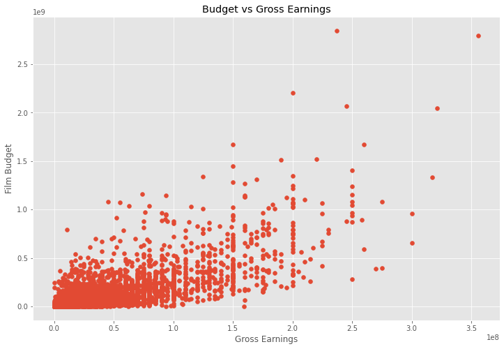
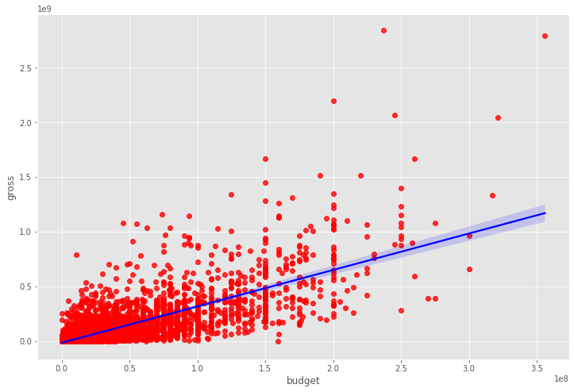
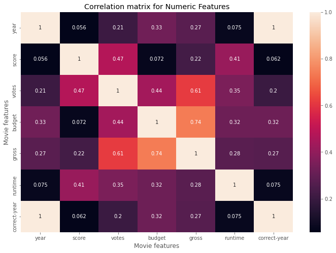
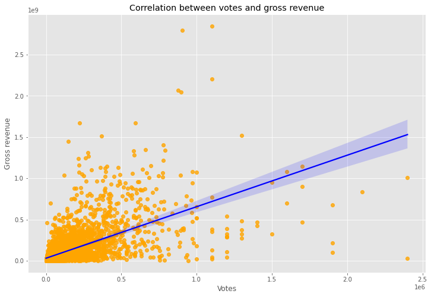
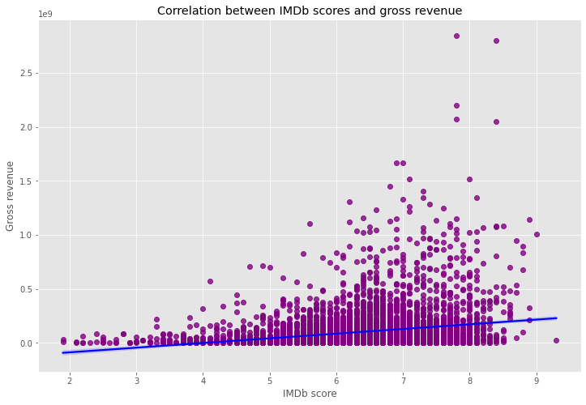
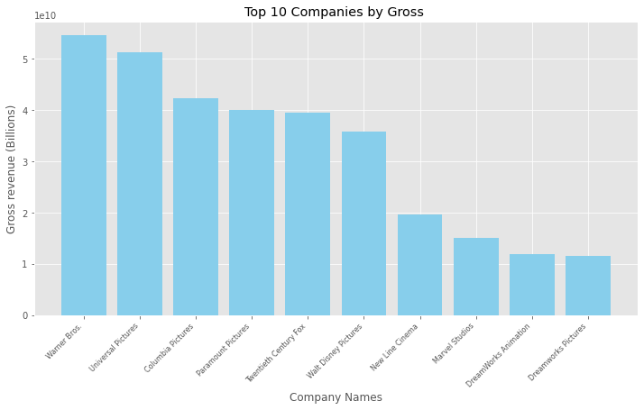
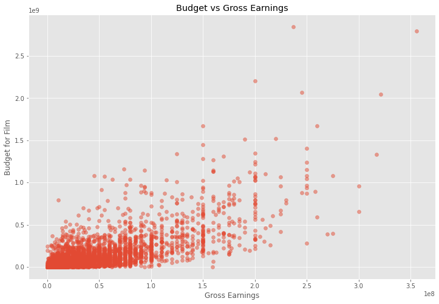
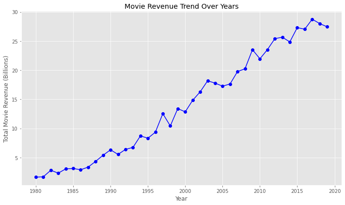

```python
#Importing Libreries

import pandas as pd
import numpy as np
import seaborn as sns

import matplotlib.pyplot as plt
import matplotlib.mlab as mlab
import matplotlib
plt.style.use('ggplot')
from matplotlib.pyplot import figure

%matplotlib inline
matplotlib.rcParams['figure.figsize'] = (12,8)

```


```python
#Reading the Data

df = pd.read_csv(r'C:\Users\Gullar\Downloads\movies.csv')
```


```python
#Looking the Data
df.head(10)
```


<div>
<style scoped>
    .dataframe tbody tr th:only-of-type {
        vertical-align: middle;
    }

    .dataframe tbody tr th {
        vertical-align: top;
    }

    .dataframe thead th {
        text-align: right;
    }
</style>
<table border="1" class="dataframe">
  <thead>
    <tr style="text-align: right;">
      <th></th>
      <th>name</th>
      <th>rating</th>
      <th>genre</th>
      <th>year</th>
      <th>released</th>
      <th>score</th>
      <th>votes</th>
      <th>director</th>
      <th>writer</th>
      <th>star</th>
      <th>country</th>
      <th>budget</th>
      <th>gross</th>
      <th>company</th>
      <th>runtime</th>
    </tr>
  </thead>
  <tbody>
    <tr>
      <th>0</th>
      <td>The Shining</td>
      <td>R</td>
      <td>Drama</td>
      <td>1980</td>
      <td>June 13, 1980 (United States)</td>
      <td>8.4</td>
      <td>927000.0</td>
      <td>Stanley Kubrick</td>
      <td>Stephen King</td>
      <td>Jack Nicholson</td>
      <td>United Kingdom</td>
      <td>19000000.0</td>
      <td>46998772.0</td>
      <td>Warner Bros.</td>
      <td>146.0</td>
    </tr>
    <tr>
      <th>1</th>
      <td>The Blue Lagoon</td>
      <td>R</td>
      <td>Adventure</td>
      <td>1980</td>
      <td>July 2, 1980 (United States)</td>
      <td>5.8</td>
      <td>65000.0</td>
      <td>Randal Kleiser</td>
      <td>Henry De Vere Stacpoole</td>
      <td>Brooke Shields</td>
      <td>United States</td>
      <td>4500000.0</td>
      <td>58853106.0</td>
      <td>Columbia Pictures</td>
      <td>104.0</td>
    </tr>
    <tr>
      <th>2</th>
      <td>Star Wars: Episode V - The Empire Strikes Back</td>
      <td>PG</td>
      <td>Action</td>
      <td>1980</td>
      <td>June 20, 1980 (United States)</td>
      <td>8.7</td>
      <td>1200000.0</td>
      <td>Irvin Kershner</td>
      <td>Leigh Brackett</td>
      <td>Mark Hamill</td>
      <td>United States</td>
      <td>18000000.0</td>
      <td>538375067.0</td>
      <td>Lucasfilm</td>
      <td>124.0</td>
    </tr>
    <tr>
      <th>3</th>
      <td>Airplane!</td>
      <td>PG</td>
      <td>Comedy</td>
      <td>1980</td>
      <td>July 2, 1980 (United States)</td>
      <td>7.7</td>
      <td>221000.0</td>
      <td>Jim Abrahams</td>
      <td>Jim Abrahams</td>
      <td>Robert Hays</td>
      <td>United States</td>
      <td>3500000.0</td>
      <td>83453539.0</td>
      <td>Paramount Pictures</td>
      <td>88.0</td>
    </tr>
    <tr>
      <th>4</th>
      <td>Caddyshack</td>
      <td>R</td>
      <td>Comedy</td>
      <td>1980</td>
      <td>July 25, 1980 (United States)</td>
      <td>7.3</td>
      <td>108000.0</td>
      <td>Harold Ramis</td>
      <td>Brian Doyle-Murray</td>
      <td>Chevy Chase</td>
      <td>United States</td>
      <td>6000000.0</td>
      <td>39846344.0</td>
      <td>Orion Pictures</td>
      <td>98.0</td>
    </tr>
    <tr>
      <th>5</th>
      <td>Friday the 13th</td>
      <td>R</td>
      <td>Horror</td>
      <td>1980</td>
      <td>May 9, 1980 (United States)</td>
      <td>6.4</td>
      <td>123000.0</td>
      <td>Sean S. Cunningham</td>
      <td>Victor Miller</td>
      <td>Betsy Palmer</td>
      <td>United States</td>
      <td>550000.0</td>
      <td>39754601.0</td>
      <td>Paramount Pictures</td>
      <td>95.0</td>
    </tr>
    <tr>
      <th>6</th>
      <td>The Blues Brothers</td>
      <td>R</td>
      <td>Action</td>
      <td>1980</td>
      <td>June 20, 1980 (United States)</td>
      <td>7.9</td>
      <td>188000.0</td>
      <td>John Landis</td>
      <td>Dan Aykroyd</td>
      <td>John Belushi</td>
      <td>United States</td>
      <td>27000000.0</td>
      <td>115229890.0</td>
      <td>Universal Pictures</td>
      <td>133.0</td>
    </tr>
    <tr>
      <th>7</th>
      <td>Raging Bull</td>
      <td>R</td>
      <td>Biography</td>
      <td>1980</td>
      <td>December 19, 1980 (United States)</td>
      <td>8.2</td>
      <td>330000.0</td>
      <td>Martin Scorsese</td>
      <td>Jake LaMotta</td>
      <td>Robert De Niro</td>
      <td>United States</td>
      <td>18000000.0</td>
      <td>23402427.0</td>
      <td>Chartoff-Winkler Productions</td>
      <td>129.0</td>
    </tr>
    <tr>
      <th>8</th>
      <td>Superman II</td>
      <td>PG</td>
      <td>Action</td>
      <td>1980</td>
      <td>June 19, 1981 (United States)</td>
      <td>6.8</td>
      <td>101000.0</td>
      <td>Richard Lester</td>
      <td>Jerry Siegel</td>
      <td>Gene Hackman</td>
      <td>United States</td>
      <td>54000000.0</td>
      <td>108185706.0</td>
      <td>Dovemead Films</td>
      <td>127.0</td>
    </tr>
    <tr>
      <th>9</th>
      <td>The Long Riders</td>
      <td>R</td>
      <td>Biography</td>
      <td>1980</td>
      <td>May 16, 1980 (United States)</td>
      <td>7.0</td>
      <td>10000.0</td>
      <td>Walter Hill</td>
      <td>Bill Bryden</td>
      <td>David Carradine</td>
      <td>United States</td>
      <td>10000000.0</td>
      <td>15795189.0</td>
      <td>United Artists</td>
      <td>100.0</td>
    </tr>
  </tbody>
</table>
</div>


```python
#First Summary Info about the data 

print(df.info())

```

    <class 'pandas.core.frame.DataFrame'>
    RangeIndex: 7668 entries, 0 to 7667
    Data columns (total 15 columns):
     #   Column    Non-Null Count  Dtype  
    ---  ------    --------------  -----  
     0   name      7668 non-null   object 
     1   rating    7591 non-null   object 
     2   genre     7668 non-null   object 
     3   year      7668 non-null   int64  
     4   released  7666 non-null   object 
     5   score     7665 non-null   float64
     6   votes     7665 non-null   float64
     7   director  7668 non-null   object 
     8   writer    7665 non-null   object 
     9   star      7667 non-null   object 
     10  country   7665 non-null   object 
     11  budget    5497 non-null   float64
     12  gross     7479 non-null   float64
     13  company   7651 non-null   object 
     14  runtime   7664 non-null   float64
    dtypes: float64(5), int64(1), object(9)
    memory usage: 898.7+ KB
    None
    


```python
#Identifying Missing Data

for col in df.columns:
    pct_missing = np.mean(df[col].isnull())
    print('{} - {}%'.format(col, round(pct_missing*100)))
```

    name - 0%
    rating - 1%
    genre - 0%
    year - 0%
    released - 0%
    score - 0%
    votes - 0%
    director - 0%
    writer - 0%
    star - 0%
    country - 0%
    budget - 28%
    gross - 2%
    company - 0%
    runtime - 0%
    


```python
# Solving Missing Data Problems 
df=df.dropna()
```


```python
#Checking Duplicate datas
num_duplicates = df.duplicated().sum()
print(f"\nNumber of duplicate rows: {num_duplicates}")
```

    
    Number of duplicate rows: 0
    


```python
# Checking Data Types for our columns

print(df.dtypes)
```

    name         object
    rating       object
    genre        object
    year          int64
    released     object
    score       float64
    votes       float64
    director     object
    writer       object
    star         object
    country      object
    budget      float64
    gross       float64
    company      object
    runtime     float64
    dtype: object
    


```python
#Changing Data types

df['budget']=df['budget'].astype('int64')
df['gross']=df['gross'].astype('int64')
df['votes']=df['votes'].astype('int64')
```


```python
# Extracting the year from the "released date" column
df['correct-year'] = df['released'].str.extract(pat = '([0-9]{4})').astype(int)
```


```python
df.head()
```


<div>
<style scoped>
    .dataframe tbody tr th:only-of-type {
        vertical-align: middle;
    }

    .dataframe tbody tr th {
        vertical-align: top;
    }

    .dataframe thead th {
        text-align: right;
    }
</style>
<table border="1" class="dataframe">
  <thead>
    <tr style="text-align: right;">
      <th></th>
      <th>name</th>
      <th>rating</th>
      <th>genre</th>
      <th>year</th>
      <th>released</th>
      <th>score</th>
      <th>votes</th>
      <th>director</th>
      <th>writer</th>
      <th>star</th>
      <th>country</th>
      <th>budget</th>
      <th>gross</th>
      <th>company</th>
      <th>runtime</th>
      <th>correct_year</th>
      <th>correct-year</th>
    </tr>
  </thead>
  <tbody>
    <tr>
      <th>5445</th>
      <td>Avatar</td>
      <td>PG-13</td>
      <td>Action</td>
      <td>2009</td>
      <td>December 18, 2009 (United States)</td>
      <td>7.8</td>
      <td>1100000</td>
      <td>James Cameron</td>
      <td>James Cameron</td>
      <td>Sam Worthington</td>
      <td>United States</td>
      <td>237000000</td>
      <td>2847246203</td>
      <td>Twentieth Century Fox</td>
      <td>162.0</td>
      <td>2009</td>
      <td>2009</td>
    </tr>
    <tr>
      <th>7445</th>
      <td>Avengers: Endgame</td>
      <td>PG-13</td>
      <td>Action</td>
      <td>2019</td>
      <td>April 26, 2019 (United States)</td>
      <td>8.4</td>
      <td>903000</td>
      <td>Anthony Russo</td>
      <td>Christopher Markus</td>
      <td>Robert Downey Jr.</td>
      <td>United States</td>
      <td>356000000</td>
      <td>2797501328</td>
      <td>Marvel Studios</td>
      <td>181.0</td>
      <td>2019</td>
      <td>2019</td>
    </tr>
    <tr>
      <th>3045</th>
      <td>Titanic</td>
      <td>PG-13</td>
      <td>Drama</td>
      <td>1997</td>
      <td>December 19, 1997 (United States)</td>
      <td>7.8</td>
      <td>1100000</td>
      <td>James Cameron</td>
      <td>James Cameron</td>
      <td>Leonardo DiCaprio</td>
      <td>United States</td>
      <td>200000000</td>
      <td>2201647264</td>
      <td>Twentieth Century Fox</td>
      <td>194.0</td>
      <td>1997</td>
      <td>1997</td>
    </tr>
    <tr>
      <th>6663</th>
      <td>Star Wars: Episode VII - The Force Awakens</td>
      <td>PG-13</td>
      <td>Action</td>
      <td>2015</td>
      <td>December 18, 2015 (United States)</td>
      <td>7.8</td>
      <td>876000</td>
      <td>J.J. Abrams</td>
      <td>Lawrence Kasdan</td>
      <td>Daisy Ridley</td>
      <td>United States</td>
      <td>245000000</td>
      <td>2069521700</td>
      <td>Lucasfilm</td>
      <td>138.0</td>
      <td>2015</td>
      <td>2015</td>
    </tr>
    <tr>
      <th>7244</th>
      <td>Avengers: Infinity War</td>
      <td>PG-13</td>
      <td>Action</td>
      <td>2018</td>
      <td>April 27, 2018 (United States)</td>
      <td>8.4</td>
      <td>897000</td>
      <td>Anthony Russo</td>
      <td>Christopher Markus</td>
      <td>Robert Downey Jr.</td>
      <td>United States</td>
      <td>321000000</td>
      <td>2048359754</td>
      <td>Marvel Studios</td>
      <td>149.0</td>
      <td>2018</td>
      <td>2018</td>
    </tr>
  </tbody>
</table>
</div>


```python
#Small correction
df.drop(columns=['correct_year'], inplace=True)
```


```python
#Sorting the data
df=df.sort_values(by=['gross'], inplace=False, ascending=False)
```


```python
# Scatter plot with budget vs gross

plt.scatter(x=df['budget'], y=df['gross'])
plt.title('Budget vs Gross Earnings')
plt.xlabel('Gross Earnings')
plt.ylabel('Film Budget')
plt.show()
```


    

    


```python
df.head()
```


<div>
<style scoped>
    .dataframe tbody tr th:only-of-type {
        vertical-align: middle;
    }

    .dataframe tbody tr th {
        vertical-align: top;
    }

    .dataframe thead th {
        text-align: right;
    }
</style>
<table border="1" class="dataframe">
  <thead>
    <tr style="text-align: right;">
      <th></th>
      <th>name</th>
      <th>rating</th>
      <th>genre</th>
      <th>year</th>
      <th>released</th>
      <th>score</th>
      <th>votes</th>
      <th>director</th>
      <th>writer</th>
      <th>star</th>
      <th>country</th>
      <th>budget</th>
      <th>gross</th>
      <th>company</th>
      <th>runtime</th>
      <th>correct-year</th>
    </tr>
  </thead>
  <tbody>
    <tr>
      <th>5445</th>
      <td>Avatar</td>
      <td>PG-13</td>
      <td>Action</td>
      <td>2009</td>
      <td>December 18, 2009 (United States)</td>
      <td>7.8</td>
      <td>1100000</td>
      <td>James Cameron</td>
      <td>James Cameron</td>
      <td>Sam Worthington</td>
      <td>United States</td>
      <td>237000000</td>
      <td>2847246203</td>
      <td>Twentieth Century Fox</td>
      <td>162.0</td>
      <td>2009</td>
    </tr>
    <tr>
      <th>7445</th>
      <td>Avengers: Endgame</td>
      <td>PG-13</td>
      <td>Action</td>
      <td>2019</td>
      <td>April 26, 2019 (United States)</td>
      <td>8.4</td>
      <td>903000</td>
      <td>Anthony Russo</td>
      <td>Christopher Markus</td>
      <td>Robert Downey Jr.</td>
      <td>United States</td>
      <td>356000000</td>
      <td>2797501328</td>
      <td>Marvel Studios</td>
      <td>181.0</td>
      <td>2019</td>
    </tr>
    <tr>
      <th>3045</th>
      <td>Titanic</td>
      <td>PG-13</td>
      <td>Drama</td>
      <td>1997</td>
      <td>December 19, 1997 (United States)</td>
      <td>7.8</td>
      <td>1100000</td>
      <td>James Cameron</td>
      <td>James Cameron</td>
      <td>Leonardo DiCaprio</td>
      <td>United States</td>
      <td>200000000</td>
      <td>2201647264</td>
      <td>Twentieth Century Fox</td>
      <td>194.0</td>
      <td>1997</td>
    </tr>
    <tr>
      <th>6663</th>
      <td>Star Wars: Episode VII - The Force Awakens</td>
      <td>PG-13</td>
      <td>Action</td>
      <td>2015</td>
      <td>December 18, 2015 (United States)</td>
      <td>7.8</td>
      <td>876000</td>
      <td>J.J. Abrams</td>
      <td>Lawrence Kasdan</td>
      <td>Daisy Ridley</td>
      <td>United States</td>
      <td>245000000</td>
      <td>2069521700</td>
      <td>Lucasfilm</td>
      <td>138.0</td>
      <td>2015</td>
    </tr>
    <tr>
      <th>7244</th>
      <td>Avengers: Infinity War</td>
      <td>PG-13</td>
      <td>Action</td>
      <td>2018</td>
      <td>April 27, 2018 (United States)</td>
      <td>8.4</td>
      <td>897000</td>
      <td>Anthony Russo</td>
      <td>Christopher Markus</td>
      <td>Robert Downey Jr.</td>
      <td>United States</td>
      <td>321000000</td>
      <td>2048359754</td>
      <td>Marvel Studios</td>
      <td>149.0</td>
      <td>2018</td>
    </tr>
  </tbody>
</table>
</div>


```python
#Data is clealy formatted and Cleaned
#It is time to identify Correlations
#Correlation between budget and gross

sns.regplot(x='budget', y='gross', data=df, scatter_kws={"color": "red"}, line_kws={"color": "blue"})
```


    <AxesSubplot:xlabel='budget', ylabel='gross'>


    

    


```python
# Time to identify Correlation

df.corr()
```


<div>
<style scoped>
    .dataframe tbody tr th:only-of-type {
        vertical-align: middle;
    }

    .dataframe tbody tr th {
        vertical-align: top;
    }

    .dataframe thead th {
        text-align: right;
    }
</style>
<table border="1" class="dataframe">
  <thead>
    <tr style="text-align: right;">
      <th></th>
      <th>year</th>
      <th>score</th>
      <th>votes</th>
      <th>budget</th>
      <th>gross</th>
      <th>runtime</th>
      <th>correct-year</th>
    </tr>
  </thead>
  <tbody>
    <tr>
      <th>year</th>
      <td>1.000000</td>
      <td>0.056386</td>
      <td>0.206021</td>
      <td>0.327722</td>
      <td>0.274321</td>
      <td>0.075077</td>
      <td>0.998726</td>
    </tr>
    <tr>
      <th>score</th>
      <td>0.056386</td>
      <td>1.000000</td>
      <td>0.474256</td>
      <td>0.072001</td>
      <td>0.222556</td>
      <td>0.414068</td>
      <td>0.061923</td>
    </tr>
    <tr>
      <th>votes</th>
      <td>0.206021</td>
      <td>0.474256</td>
      <td>1.000000</td>
      <td>0.439675</td>
      <td>0.614751</td>
      <td>0.352303</td>
      <td>0.203098</td>
    </tr>
    <tr>
      <th>budget</th>
      <td>0.327722</td>
      <td>0.072001</td>
      <td>0.439675</td>
      <td>1.000000</td>
      <td>0.740247</td>
      <td>0.318695</td>
      <td>0.320312</td>
    </tr>
    <tr>
      <th>gross</th>
      <td>0.274321</td>
      <td>0.222556</td>
      <td>0.614751</td>
      <td>0.740247</td>
      <td>1.000000</td>
      <td>0.275796</td>
      <td>0.268721</td>
    </tr>
    <tr>
      <th>runtime</th>
      <td>0.075077</td>
      <td>0.414068</td>
      <td>0.352303</td>
      <td>0.318695</td>
      <td>0.275796</td>
      <td>1.000000</td>
      <td>0.075294</td>
    </tr>
    <tr>
      <th>correct-year</th>
      <td>0.998726</td>
      <td>0.061923</td>
      <td>0.203098</td>
      <td>0.320312</td>
      <td>0.268721</td>
      <td>0.075294</td>
      <td>1.000000</td>
    </tr>
  </tbody>
</table>
</div>


# High Correllation between budget and gross


```python
correlation_matrix = df.corr(method='pearson')

sns.heatmap(correlation_matrix, annot = True)

plt.title("Correlation matrix for Numeric Features")

plt.xlabel("Movie features")

plt.ylabel("Movie features")

plt.show()

```


    

    


```python
#Correlation between votes and gross revenue

sns.regplot(x='votes',y='gross',data=df,scatter_kws={'color': 'orange'},line_kws={'color' : 'blue'})
plt.title('Correlation between votes and gross revenue')
plt.xlabel('Votes')
plt.ylabel('Gross revenue')
```


    Text(0, 0.5, 'Gross revenue')


    

    


```python
#Correlation between IMDb scores and gross revenue

sns.regplot(x='score',y='gross',data=df,scatter_kws={'color': 'purple'},line_kws={'color' : 'blue'})
plt.title('Correlation between IMDb scores and gross revenue')
plt.xlabel('IMDb score')
plt.ylabel('Gross revenue')
```


    Text(0, 0.5, 'Gross revenue')


    

    


```python
correlation_mat = df.apply(lambda x: x.factorize()[0]).corr()

corr_pairs = correlation_mat.unstack()

print(corr_pairs)
```

    name          name            1.000000
                  rating          0.314800
                  genre           0.186668
                  year            0.267282
                  released        0.667785
                                    ...   
    correct-year  budget          0.183598
                  gross           0.272536
                  company         0.134709
                  runtime         0.036785
                  correct-year    1.000000
    Length: 256, dtype: float64
    


```python
sorted_pairs = corr_pairs.sort_values(kind="quicksort")

print(sorted_pairs)
```

    score         rating         -0.075109
    rating        score          -0.075109
    score         country        -0.057087
    country       score          -0.057087
    genre         country        -0.055109
                                    ...   
    year          year            1.000000
    genre         genre           1.000000
    rating        rating          1.000000
    runtime       runtime         1.000000
    correct-year  correct-year    1.000000
    Length: 256, dtype: float64
    


```python
# Sorting the ones that have a high correlation (> 0.5)

strong_pairs = sorted_pairs[abs(sorted_pairs) > 0.5]

print(strong_pairs)
```

    star          director        0.504992
    director      star            0.504992
    writer        star            0.510628
    star          writer          0.510628
    writer        votes           0.522918
                                    ...   
    year          year            1.000000
    genre         genre           1.000000
    rating        rating          1.000000
    runtime       runtime         1.000000
    correct-year  correct-year    1.000000
    Length: 62, dtype: float64
    

# Result!!

#Votes and Budget have highest correlation

#Company has the lowest correlation 


```python
# Top ten companies with higest gross revenue 

gross_by_comp = df.groupby('company')[['gross']].sum()
top_10_companies= rev_by_comp.sort_values('gross', ascending = False)[:10]
top_10_companies
```


<div>
<style scoped>
    .dataframe tbody tr th:only-of-type {
        vertical-align: middle;
    }

    .dataframe tbody tr th {
        vertical-align: top;
    }

    .dataframe thead th {
        text-align: right;
    }
</style>
<table border="1" class="dataframe">
  <thead>
    <tr style="text-align: right;">
      <th></th>
      <th>gross</th>
    </tr>
    <tr>
      <th>company</th>
      <th></th>
    </tr>
  </thead>
  <tbody>
    <tr>
      <th>Warner Bros.</th>
      <td>54610959970</td>
    </tr>
    <tr>
      <th>Universal Pictures</th>
      <td>51241105418</td>
    </tr>
    <tr>
      <th>Columbia Pictures</th>
      <td>42356430218</td>
    </tr>
    <tr>
      <th>Paramount Pictures</th>
      <td>40021704691</td>
    </tr>
    <tr>
      <th>Twentieth Century Fox</th>
      <td>39542573303</td>
    </tr>
    <tr>
      <th>Walt Disney Pictures</th>
      <td>35833650748</td>
    </tr>
    <tr>
      <th>New Line Cinema</th>
      <td>19612851164</td>
    </tr>
    <tr>
      <th>Marvel Studios</th>
      <td>15065592411</td>
    </tr>
    <tr>
      <th>DreamWorks Animation</th>
      <td>11873612858</td>
    </tr>
    <tr>
      <th>Dreamworks Pictures</th>
      <td>11593807697</td>
    </tr>
  </tbody>
</table>
</div>


```python
#Top 10 Companies by Gross

comp_df = pd.DataFrame({'gross': top_10_companies['gross']}).reset_index()
plt.figure(figsize=(12, 6))
plt.bar(comp_df['company'], comp_df['gross'], color='skyblue')
plt.xticks(rotation=45, ha='right', fontsize=8) 
plt.xlabel('Company Names')
plt.ylabel('Gross revenue (Billions)')
plt.title('Top 10 Companies by Gross ')
```


    Text(0.5, 1.0, 'Top 10 Companies by Gross ')


    

    


```python
df.groupby(['company', 'year'])[["gross"]].sum()
```


<div>
<style scoped>
    .dataframe tbody tr th:only-of-type {
        vertical-align: middle;
    }

    .dataframe tbody tr th {
        vertical-align: top;
    }

    .dataframe thead th {
        text-align: right;
    }
</style>
<table border="1" class="dataframe">
  <thead>
    <tr style="text-align: right;">
      <th></th>
      <th></th>
      <th>gross</th>
    </tr>
    <tr>
      <th>company</th>
      <th>year</th>
      <th></th>
    </tr>
  </thead>
  <tbody>
    <tr>
      <th>0</th>
      <th>2003</th>
      <td>44350926</td>
    </tr>
    <tr>
      <th>1</th>
      <th>2019</th>
      <td>193457467</td>
    </tr>
    <tr>
      <th>2</th>
      <th>1996</th>
      <td>10580</td>
    </tr>
    <tr>
      <th rowspan="2" valign="top">3</th>
      <th>1996</th>
      <td>129832389</td>
    </tr>
    <tr>
      <th>1999</th>
      <td>87423861</td>
    </tr>
    <tr>
      <th>...</th>
      <th>...</th>
      <td>...</td>
    </tr>
    <tr>
      <th>1470</th>
      <th>2013</th>
      <td>587174</td>
    </tr>
    <tr>
      <th>1471</th>
      <th>2015</th>
      <td>17986781</td>
    </tr>
    <tr>
      <th>1472</th>
      <th>2001</th>
      <td>10031529</td>
    </tr>
    <tr>
      <th>1473</th>
      <th>2010</th>
      <td>7099598</td>
    </tr>
    <tr>
      <th>1474</th>
      <th>2017</th>
      <td>62198461</td>
    </tr>
  </tbody>
</table>
<p>2987 rows × 1 columns</p>
</div>


```python
CompanyGrossSum = df.groupby(['company', 'year'])[["gross"]].sum()

CompanyGrossSumSorted = CompanyGrossSum.sort_values(['gross','company','year'], ascending = False)[:15]

CompanyGrossSumSorted = CompanyGrossSumSorted['gross'].astype('int64') 

CompanyGrossSumSorted
```


    company  year
    1423     2019    5773131804
    983      2018    4018631866
    1397     2015    3834354888
    1382     2009    3793491246
    1423     2017    3789382071
    1108     2011    3565705182
    1426     2011    3223799224
    1423     2010    3104474158
    1108     2014    3071298586
    452      2006    2934631933
             2019    2932757449
    983      2019    2797501328
    1426     2018    2774168962
    452      2011    2738363306
    1426     2005    2688767210
    Name: gross, dtype: int64


```python
#Budget vs Gross Earnings

plt.scatter(x=df['budget'], y=df['gross'], alpha=0.5)
plt.title('Budget vs Gross Earnings')
plt.xlabel('Gross Earnings')
plt.ylabel('Budget for Film')
plt.show()
```


    

    


```python
#Gross revenue over the years

rev_by_year = df.groupby('correct-year')[['gross']].sum()
year_rev = rev_by_year.sort_values('correct-year', ascending = True)
year_rev.head(10)
```


<div>
<style scoped>
    .dataframe tbody tr th:only-of-type {
        vertical-align: middle;
    }

    .dataframe tbody tr th {
        vertical-align: top;
    }

    .dataframe thead th {
        text-align: right;
    }
</style>
<table border="1" class="dataframe">
  <thead>
    <tr style="text-align: right;">
      <th></th>
      <th>gross</th>
    </tr>
    <tr>
      <th>correct-year</th>
      <th></th>
    </tr>
  </thead>
  <tbody>
    <tr>
      <th>1980</th>
      <td>1629441719</td>
    </tr>
    <tr>
      <th>1981</th>
      <td>1704434042</td>
    </tr>
    <tr>
      <th>1982</th>
      <td>2818579164</td>
    </tr>
    <tr>
      <th>1983</th>
      <td>2322799554</td>
    </tr>
    <tr>
      <th>1984</th>
      <td>3059795115</td>
    </tr>
    <tr>
      <th>1985</th>
      <td>3125228778</td>
    </tr>
    <tr>
      <th>1986</th>
      <td>2903916792</td>
    </tr>
    <tr>
      <th>1987</th>
      <td>3362617687</td>
    </tr>
    <tr>
      <th>1988</th>
      <td>4345641781</td>
    </tr>
    <tr>
      <th>1989</th>
      <td>5400480835</td>
    </tr>
  </tbody>
</table>
</div>


```python
#Movie Revenue Trend Over Years

year_df = pd.DataFrame({'gross': year_rev['gross']}).reset_index()
year_df = year_df[year_df['correct-year'] != 2020]
plt.figure(figsize=(10, 6))

#!!!the data for 2020 only covers up to September. So I drop it from this data frame.

# Plot the line chart over years
plt.plot(year_df['correct-year'], year_df['gross'] / 1e9, marker='o', color='blue', linestyle='-')
plt.xlabel('Year')
plt.ylabel('Total Movie Revenue (Billions)')
plt.title('Movie Revenue Trend Over Years')

plt.tight_layout()
plt.show()

```


    

    


```python

```
